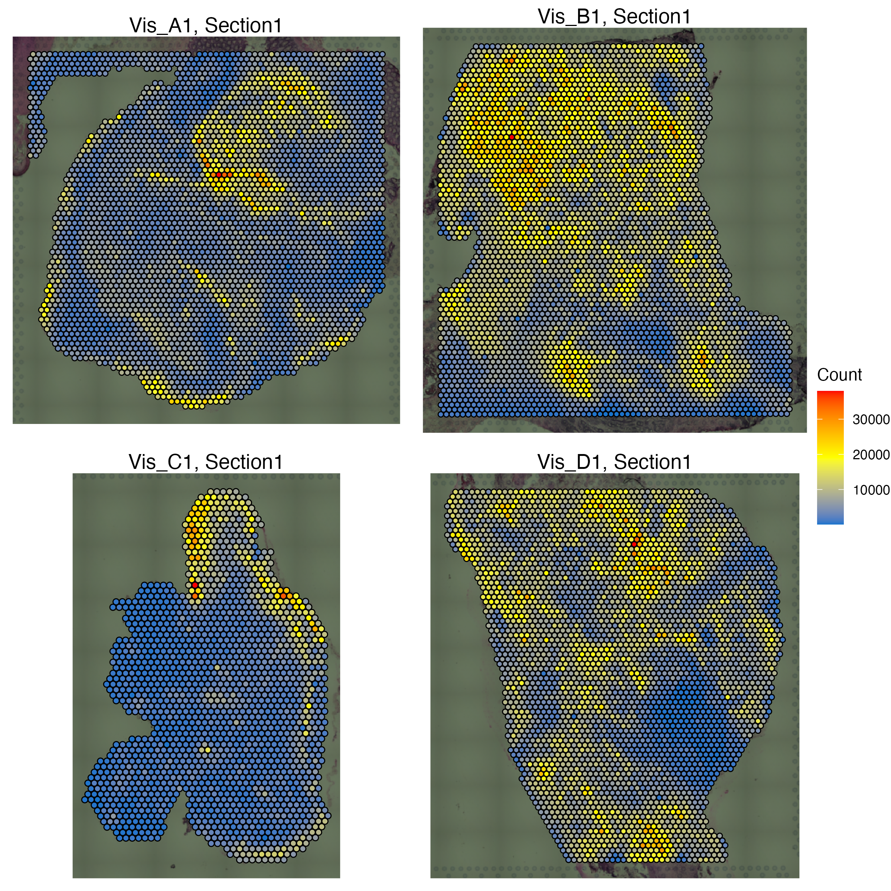
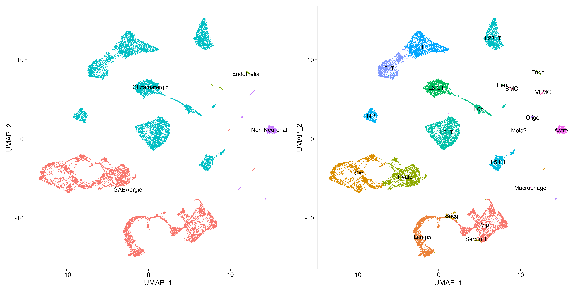
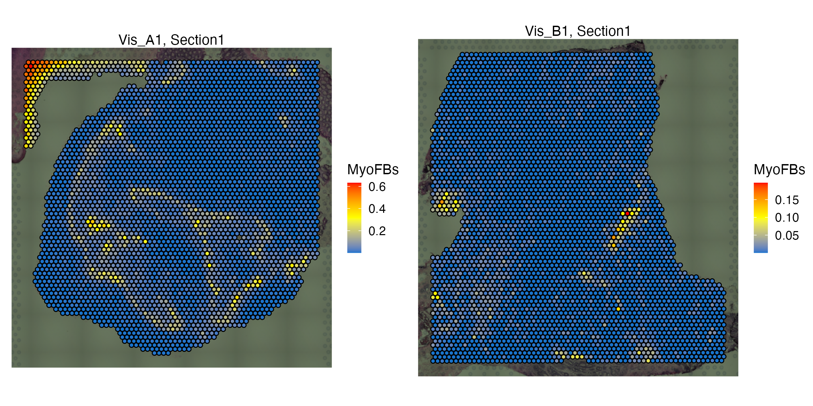
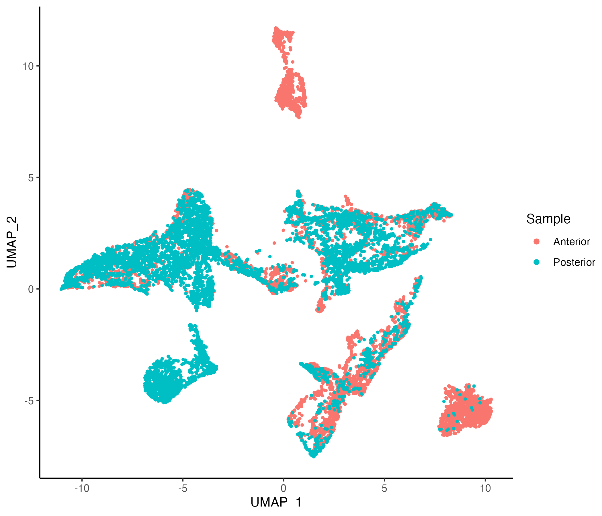
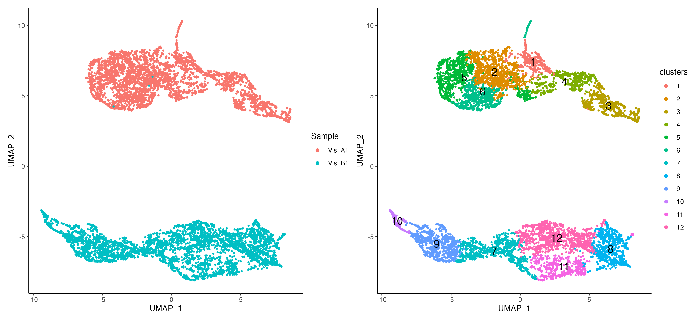
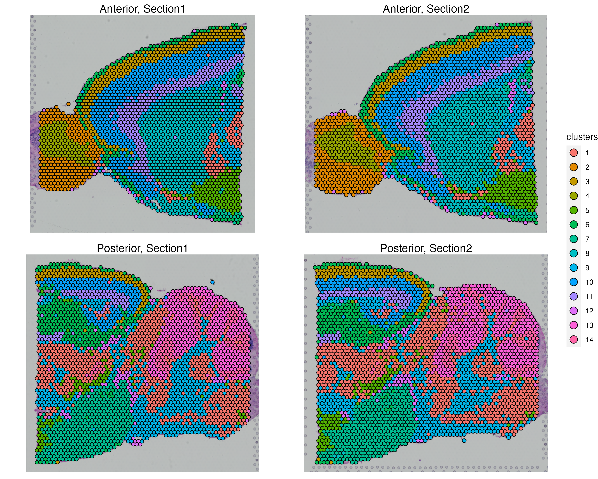
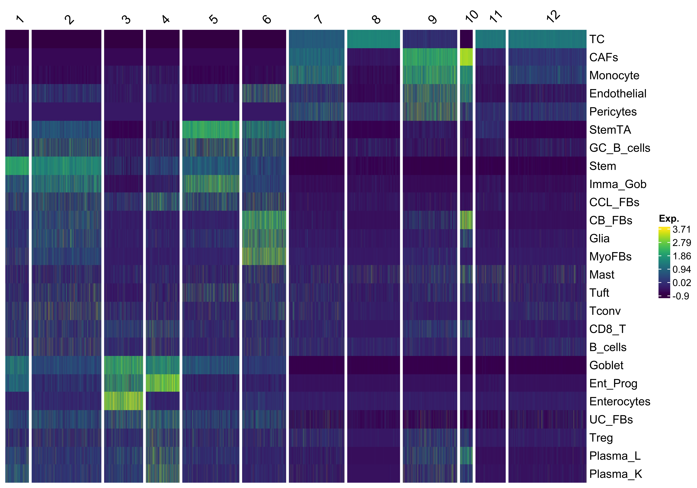

<style>
.title{
  display: none;
}
body {
  text-align: justify
}
.center {
  display: block;
  margin-left: auto;
  margin-right: auto;
}
</style>

```{css, echo=FALSE}
.watch-out {
  color: black;
}
```

```{r setup, include=FALSE}
# use rmarkdown::render_site(envir = knitr::knit_global())
knitr::opts_chunk$set(highlight = TRUE, echo = TRUE)
```

<br>

# Spot Deconvolution and Niche Clustering

Essentially, Spots in transcriptomics assays such as [Visium](https://www.10xgenomics.com/products/spatial-gene-expression) include often some arbitrary number of cells that are of multiple types. RNA Deconvolution is then incorporated to estimate the percentage/abundance of these cell types within each spot/ROI given a reference scRNAseq dataset. 

VoltRon includes wrapper commands for using popular RNA deconvolution methods such as [RCTD](https://www.nature.com/articles/s41587-021-00830-w) (**spot**) and return estimated abundances as additional assays within each layer. These novel assays then can be further processed and used for clustering to detect niches across multiple datatypes.

<!-- VoltRon includes wrapper commands for using popular RNA deconvolution methods such as [RCTD](https://www.nature.com/articles/s41587-021-00830-w) (**spot**), [SPOTlight](https://academic.oup.com/nar/article/49/9/e50/6129341) (**spot**) and [MuSiC](https://www.nature.com/articles/s41467-018-08023-x) (**ROI**), and return estimated abundances as additional assays within each layer. These novel assays then can be further processed and used for clustering to detect niches across multiple datatypes.   -->

<br>

## Import ST Data

We will now import the samples and merge them into one VoltRon object. 

```{r eval = FALSE, class.source="watch-out"}
library(VoltRon)

# import Visium data
Ant_Sec1 <- importVisium("../data/10X_Visium_Mouse_Brain/Sagittal_Anterior/Section1/", 
                         sample_name = "Anterior1")
Ant_Sec2 <- importVisium("../data/10X_Visium_Mouse_Brain/Sagittal_Anterior/Section2/", 
                         sample_name = "Anterior2")
Pos_Sec1 <- importVisium("../data/10X_Visium_Mouse_Brain/Sagittal_Posterior/Section1/", 
                         sample_name = "Posterior1")
Pos_Sec2 <- importVisium("../data/10X_Visium_Mouse_Brain/Sagittal_Posterior/Section2/", 
                         sample_name = "Posterior2")

# merge datasets
MBrain_Sec_list <- list(Ant_Sec1, Ant_Sec2, Pos_Sec1, Pos_Sec2)
MBrain_Sec <- merge(MBrain_Sec_list[[1]], MBrain_Sec_list[-1], 
                    samples = c("Anterior", "Anterior", "Posterior", "Posterior"))
vrSpatialFeaturePlot(MBrain_Sec, features = "Count", crop = TRUE, alpha = 1, ncol = 2)
```

```
VoltRon Object 
Anterior: 
  Layers: Section1 Section2 
Posterior: 
  Layers: Section1 Section2 
Assays: Visium(Main) 
```

```{r eval = FALSE, class.source="watch-out"}
vrSpatialFeaturePlot(MBrain_Sec, features = "Count", crop = TRUE, alpha = 1, ncol = 2)
```



<br>

## Import scRNA data

We will now import the scRNA data for reference

```{r eval = FALSE, class.source="watch-out"}
library(Seurat)
allen_reference <- readRDS("../data/10X_Visium_Mouse_Brain/allen_cortex.rds")

# process and reduce dimensionality
allen_reference <- SCTransform(allen_reference, ncells = 3000, verbose = FALSE) %>%
  RunPCA(verbose = FALSE) %>%
  RunUMAP(dims = 1:30)

# update labels and subset
allen_reference$subclass <- gsub("L2/3 IT", "L23 IT", allen_reference$subclass)
allen_reference <- allen_reference[,colnames(allen_reference)[!allen_reference@meta.data$subclass %in% "CR"]]

# visualize
Idents(allen_reference) <- "subclass"
gsubclass <- DimPlot(allen_reference, reduction = "umap", label = T) + NoLegend()
Idents(allen_reference) <- "class"
gclass <- DimPlot(allen_reference, reduction = "umap", label = T) + NoLegend()
gsubclass | gclass
```



<br>

## Spot Deconvolution with RCTD

In order to integrate the scRNA data and the Visium data sets within the VoltRon objects, we will use **RCTD** algorithm which is accessible with the [spacexr](https://github.com/dmcable/spacexr) package. For all layers with a Visium data, an additional assay within the same layer with **_decon** postfix will be created. 

It is important at this stage to deconvolute the spots with phenotypically best suitable single cell reference. Hence, we subset and create aditional Seurat objects for each individual type of Visium assay. 

```{r eval = FALSE, class.source="watch-out"}
# libraries for RCTD algorithm
library(spacexr)

# Deconvolute anterior and posterior Visium spots
MBrain_Sec <- getDeconvolution(MBrain_Sec, sc.object = allen_reference, 
                               sc.cluster = "subclass", max_cores = 6)
MBrain_Sec
```

```
VoltRon Object 
Anterior: 
  Layers: Section1 Section2 
Posterior: 
  Layers: Section1 Section2 
Assays: Visium_decon(Main) Visium 
```

We can now switch to the **Visium_decon** assays where features are now cell types from the scRNA reference and the data values are cell types percentages in each spot. 

```{r eval = FALSE, class.source="watch-out"}
vrMainAssay(Vis_CRC) <- "Visium_decon"
vrFeatures(Vis_CRC)
```

```
 [1] "Astro"      "Endo"       "L23 IT"     "L4"         "L5 IT"      "L5 PT"     
 [7] "L6 CT"      "L6 IT"      "L6b"        "Lamp5"      "Macrophage" "Meis2"     
[13] "NP"         "Oligo"      "Peri"       "Pvalb"      "Serpinf1"   "SMC"       
[19] "Sncg"       "Sst"        "Vip"        "VLMC"          
```

These features (i.e. cell type abundances) can be visualized like any other feature. 

```{r eval = FALSE, class.source="watch-out"}
vrSpatialFeaturePlot(MBrain_Sec, features = c("L4", "L5 PT", "Oligo", "Vip"), 
                     crop = TRUE, ncol = 2, alpha = 1, keep.scale = "all")
```



<br>

## Niche Clustering 

Relative cell type abundances that are learned by RCTD and stored within VoltRon can now be used to cluster spots. These groups or clusters of spots now can be realized as **niches**, regions within tissue sections that have a distinct cell type composition compared to other groups. 

We will now normalize and process relative cell type abundances to learn these niche clusters. Cell type abundance can be realized as [compositional data](https://en.wikipedia.org/wiki/Compositional_data), hence we incorporate **centred log ratio (CLR)** transformation for normalizing these relative abundances.

```{r eval = FALSE, class.source="watch-out"}
MBrain_Sec <- normalizeData(MBrain_Sec, method = "CLR")
```

The CLR normalized assay have only 25 features, each representing a cell type from the single cell reference data. Hence, we can **directly calculate UMAP reductions from this feature set** without relying on a prior dimensionality reduction such as PCA.

VoltRon is also capable of calculating the UMAP reduction from normalized data slots. Hence, we build a UMAP reduction from CLR data. However, UMAP will always be calculated from a PCA reduction by default (if a PCA embedding is found in the object). 

```{r eval = FALSE, class.source="watch-out"}
MBrain_Sec <- getUMAP(MBrain_Sec, assay = "Visium_decon", data.type = "norm")
vrEmbeddingPlot(MBrain_Sec, embedding = "umap", group.by = "Sample")
```



<br>

Using normalized cell type abundances, we can now generate k-nearest neighbor graphs and cluster the graph using leiden method.  

```{r eval = FALSE, class.source="watch-out"}
# get neighbors
MBrain_Sec <- getNeighbors(MBrain_Sec, assay = "Visium_decon", data.type = "norm")

# get clustering
MBrain_Sec <- getClusters(MBrain_Sec, resolution = 0.6)
```

## Visualization

VoltRon incorporates distinct plotting functions for, e.g. embeddings, coordinates, heatmap and even barplots. We can now map the clusters we have generated on the UMAP embeddings. 

```{r eval = FALSE, class.source="watch-out"}
# visualize 
g1 <- vrEmbeddingPlot(MBrain_Sec, embedding = "umap", group.by = "Sample")
g2 <- vrEmbeddingPlot(MBrain_Sec, embedding = "umap", group.by = "clusters", label = TRUE)
g1 | g2
```



<br>

We can map these clusters on the tissue and investigate the locations of spots that are of similar niches. 

```{r eval = FALSE, class.source="watch-out"}
vrSpatialPlot(MBrain_Sec, group.by = "clusters", crop = TRUE, alpha = 1)
```



<br>

<!-- <table> -->
<!-- <tr> -->
<!--   <td width="53%"> </td> -->
<!--   <td width="46%"> </td> -->
<!-- </tr> -->
<!-- </table> -->

We use **vrHeatmapPlot** to investigate relative cell type abundances across clusters.

```{r eval = FALSE, class.source="watch-out"}
vrHeatmapPlot(MBrain_Sec, features = vrFeatures(MBrain_Sec), group.by = "clusters", 
              show_row_names = T, show_heatmap_legend = T)
```


<br>
