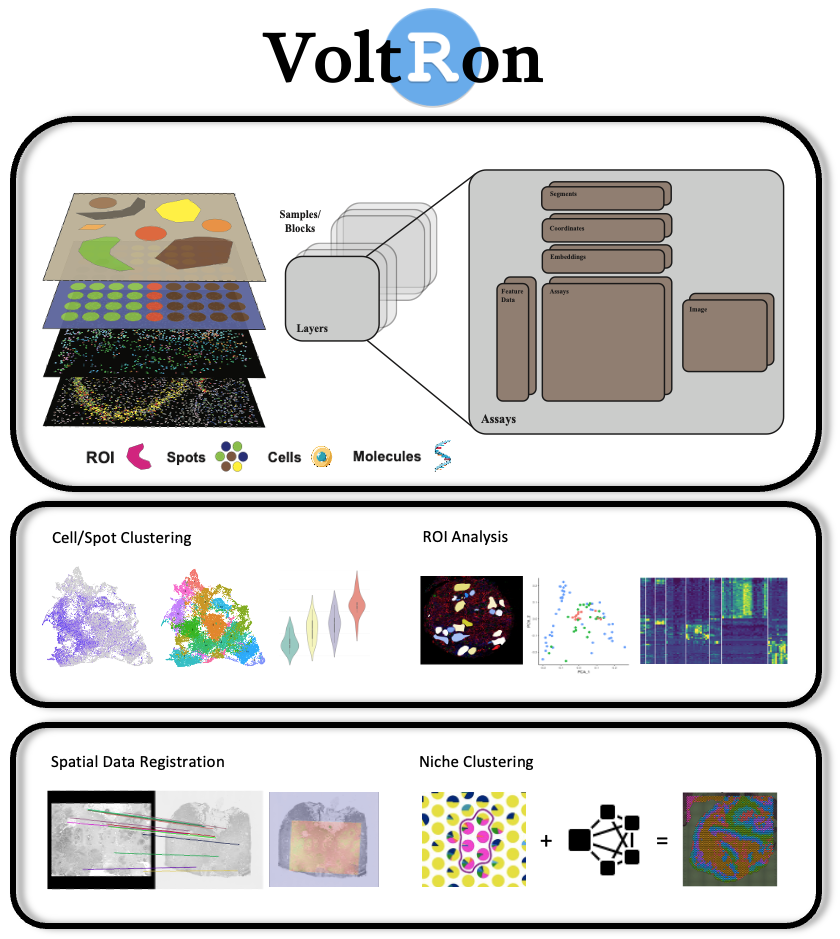

<style>
.title{
  display: none;
}
body {
  text-align: justify;
}
.center {
  display: block;
  margin-left: auto;
  margin-right: auto;
}
.main-container {
  max-width: 1200px;
  margin-left: auto;
  margin-right: auto;
}
p.maintext {
  font-size: 1.2em;
}
table td, table td * {
    vertical-align: top;
}
ul.maintext2 {
  font-size: 1.1em; 
}
il.maintext2 {
  font-size: 1.1em; 
}
</style>

```{r setup, include=FALSE}
# use rmarkdown::render_site(envir = knitr::knit_global())
knitr::opts_chunk$set(echo = TRUE)
```

<br>
<br>

<!-- ## VoltRon: An R package for Spatial Data Analysis and Integration -->

<br>

<table>
  <tr>
   <td style = "width:44%;"> 
      
   </td>
   <td style = "width:3%;"> 
   </td>
   <td style = "width:53%;"> 
   <br>
   <br>
   <p class="maintext"> <strong> VoltRon </strong> is a novel spatial data analysis toolbox for spatial data analysis, multi-omics integration using spatial image registration. VoltRon is capable of analyzing multiple types and modalities of spatially-aware datasets.</p>
   <ul class="maintext2">
     <li style="padding-bottom: 10px">
      <strong> Unique data structure </strong> of VoltRon allows users to seamlessly define tissue blocks, layers and multiple assay types.
     </li>
     <li style="padding-bottom: 10px">
      <strong> End-to-end Analysis for distinct spatial biology technologies </strong> are supported. VoltRon visualizes and analyzes regions of interests (ROIs), spots, cells and even molecules **(under development)**.
     </li>
    <li style="padding-bottom: 10px">
      <strong> Automated Image Registration </strong> incorporates <a href="https://opencv.org/">OpenCV</a> (fully embedded into the package using <a href="https://www.rcpp.org/">Rcpp</a>) to detect common features across images and achieves registration. Users may interact with built-in mini shiny apps to change alignment parameters and validate accuracy. 
    </li>
    <li style="padding-bottom: 10px">
      <strong> Manual Image Registration </strong> helps users to select common features across spatial datasets using reference images stored in spaceRover object. In case, automated registration doesnt work, you can still align images.
    </li>
    <li style="padding-bottom: 10px">
      <strong> Niche Clustering </strong> allows integration to single cell RNA analysis platforms such as <a href="https://satijalab.org/seurat/">Seurat</a> and <a href="https://github.com/dmcable/spacexr">spacexr</a> to deconvolute spots using reference single cell datasets. Estimated cell type abundances are then used to partition spots into groups of cell type niches, defined as spots with distinct composition of cell types.  
    </li>
   </ul>
   </td>
   <td> 
   </td>
  </tr>
</table>
