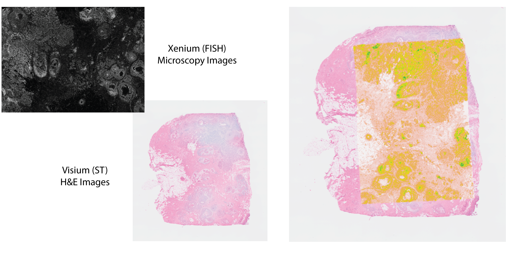
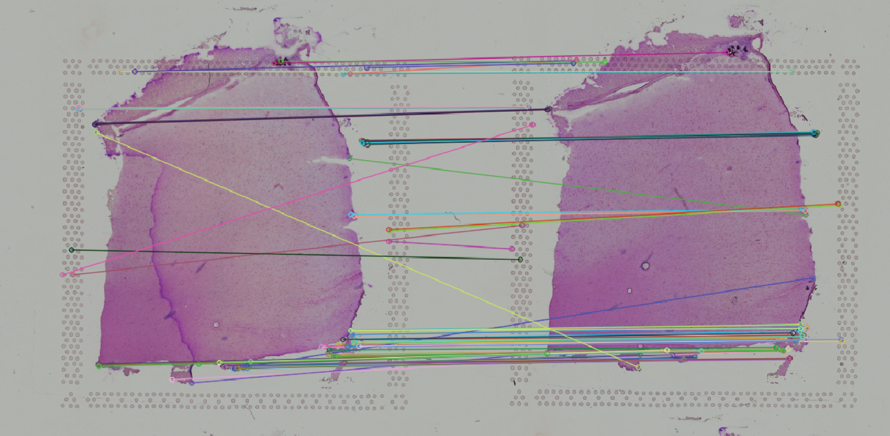
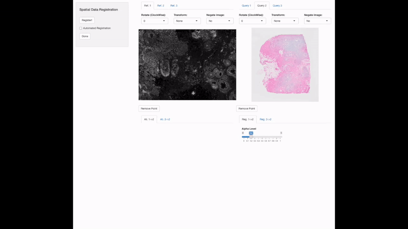
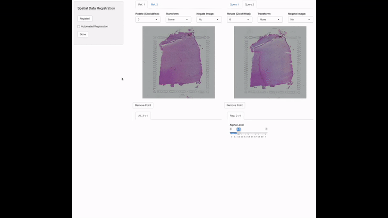

<style>
body {
  text-align: justify
}
.center {
  display: block;
  margin-left: auto;
  margin-right: auto;
}
</style>

```{css, echo=FALSE}
.watch-out {
  color: black;
}
```

```{r setup, include=FALSE}
# use rmarkdown::render_site(envir = knitr::knit_global())
knitr::opts_chunk$set(highlight = TRUE, echo = TRUE)
```

<br>

# Spatial Data Alignment

At its core, VoltRon allows users to align multiple consecutive spatial data slices for data transfer and 3 dimensional stack alignment. The order of the tissue/sample slices, and the prior information on the adjacency of these slices, should be provided by the user. VoltRon provides a fully embedded shiny application to allow users to either automatically or manually align consecutive 2d spatial datasets. 

Using both automated or manual alignment options, users are given the option to tune the alignment parameters to check the accuracy of the alignment.

<br>

<table>
<tbody>
  <tr style = "vertical-align: center">
  <td style = "width:43%; vertical-align: center"> </td>
  <td style = "width:43%; vertical-align: center"> </td>
  </tr>
</tbody>
</table>

<br>

## Alignment of Xenium and Visium 

In this use case, we will align immunofluorescence (IF) and H&E images associated with the readouts of Xenium In Situ and Visium CytAssist platforms. Tissue sections are derived from a single formalin-fixed, paraffin-embedded (FFPE) breast cancer tissue block where 3 serial sections of 5 $\mu$m thickness. A 5 $\mu$m section was taken for Visium CytAssist and two replicate 5 $\mu$m sections were taken for Xenium. The dataset is download from [here](https://www.10xgenomics.com/products/xenium-in-situ/preview-dataset-human-breast).

More information on the dataset and the study can be also be found on the [BioArxiv preprint](https://www.biorxiv.org/content/10.1101/2022.10.06.510405v1).

VoltRon includes built-in functions to converting readouts from both Xenium and Visium platforms into VoltRon objects. We will import both Xenium replicates alongside with the Visium CytAssist data.

```{r eval = FALSE, class.source="watch-out"}
library(VoltRon)
Xen_seu_R1 <- importXenium("Xenium_R1/outs", sample_name = "XeniumR1")
Xen_seu_R2 <- importXenium("Xenium_R2/outs", sample_name = "XeniumR2")
Vis_seu <- importVisium("Visium/outs", sample_name = "VisiumR1")
```

```{r eval = FALSE, include=FALSE, class.source="watch-out"}
library(Seurat)

# Load Xenium Data
Xen_seu_R1 <- importXenium("../../../data/10X_Xenium_Visium/Xenium_R1/outs", sample_name = "XeniumR1")

# Load Xenium Data
Xen_seu_R2 <- importXenium("../../../data/10X_Xenium_Visium/Xenium_R2/outs", sample_name = "XeniumR2")

# Load Visium Data
Vis_seu <- importVisium("../../../data/10X_Xenium_Visium/Visium", sample_name = "VisiumR1")

# saved keypoints
keypoints <- readRDS("../../../workflows/saveddata/Xenium&Visium_keypoints.rds")
keypoints <- list(`1-2` = list(ref = keypoints[[2]], query = keypoints[[1]]),
                  `2-3` = list(ref = keypoints[[1]], query = keypoints[[3]]))
xen_reg <- registerSpatialData(data_list = list(Xen_seu_R1, Vis_seu, Xen_seu_R2), keypoints = keypoints)
```

<br>

### Manual Image Alignment

In order to achieve data transfer and integration across these two modalities, we need to first make sure that spatial coordinate spaces of these three datasets are aligned. For this, we will make use of the **registerSpatialData** function which calls a small shiny app embedded into VoltRon. Users have to provide the list of VoltRon objects associated with each dataset where the order of components of the list should be the same as the serial order of the sections within the tissue/sample block. 

In this example, we will manually choose keypoints (or landmarks) that are observed to be common across pairs of images. The image in the middle (Visium CytAssist) would be taken as the image of reference, and hence all other images (or spatial datasets) are to be aligned to the Visium data. **registerSpatialData** will return a list of VoltRon objects whose assays include both the original and registered versions of spatial coordinates and images.

```{r class.source="watch-out", eval = FALSE} 
xen_reg <- registerSpatialData(data_list = list(Xen_seu_R1, Vis_seu, Xen_seu_R2))
```



The returned list will also include a set of keypoints selected by the user if they have used manual alignment. You can use this keypoints object again to call **registerSpatialData** and reproduce the earlier manual alignment. 

```{r class.source="watch-out", eval = FALSE} 
keypoints <- xen_reg$keypoints
xen_reg <- registerSpatialData(data_list = list(Xen_seu_R1, Vis_seu, Xen_seu_R2), keypoints = keypoints)
```

```{r class.source="watch-out", eval = FALSE, include=FALSE}
keypoints <- readRDS("saved_keypoints/Xenium&Visium_keypoints.rds")
keypoints <- list(`1-2` = list(ref = keypoints[[2]], query = keypoints[[1]]),
                  `2-3` = list(ref = keypoints[[1]], query = keypoints[[3]]))
xen_reg <- registerSpatialData(data_list = list(Xen_seu_R1, Vis_seu, Xen_seu_R2), keypoints = keypoints)
```

<br>

### Combine VoltRon object

Now that the VoltRon objects of Xenium and Visium datasets are accurately aligned, we can combine these objects to create one VoltRon object with three layers. Since all sections are derived from the same tissue block, we want them to be associated with the same sample, hence we define the sample name as well. 

VoltRon will pick the assay type that is of the majority across all layers across the VoltRon object and appoint that as the main assay.

```{r class.source="watch-out", eval = FALSE}
merge_list <- xen_reg$registered_spat
SRBlock <- merge(merge_list[[1]], merge_list[-1], sample_name = "10XBlock")
SRBlock
```
```
10XBlock: 
  Layers: Section1 Section2 Section3 
Assays: Xenium (Main) Visium
```

<br>

## Alignment of DLPFC Visium

In the next use case, we will align H&E images associated with Visium data generated from tissue block sections of adult humans with postmortem dorsolateral prefrontal cortex (DLPFC). Two pairs of adjacent sections, that are 10 $\mu$m away from each other, was obtained from the tissue block of the third donor. Hence, we align each pair individually. 

```{r class.source="watch-out", eval = FALSE} 
DLPFC_1 <- importVisium("../../../data/10X_Visium_DLPFC/151673", sample_name = "DLPFC_1")
DLPFC_2 <- importVisium("../../../data/10X_Visium_DLPFC/151674", sample_name = "DLPFC_2")
DLPFC_3 <- importVisium("../../../data/10X_Visium_DLPFC/151675", sample_name = "DLPFC_3")
DLPFC_4 <- importVisium("../../../data/10X_Visium_DLPFC/151676", sample_name = "DLPFC_4")
```

<br>

### Automated Image Alignment

We will use the **registerSpatialData** function to automatically register H&E images, and hence two VoltRon objects, to each other, without choosing the landmark points. The shiny app will provide two images for this task: (i) the matching image that shows the automated matched points across two images, and (ii) a slideshow with both registered images that demonstrates the accuracy of the alignment. 

This app also provide two tuning parameters that used by the OpenCV's image registration workflow fully embedded in VoltRon. The **# of Features** option specifies the number of maximum image features spotted within each image which later be used to match these across multiple images, and the **Match %** specifies part percentage of these features should be matching at max to be used to compute the registeration/transformation matrix. The same matrix is used to convert the spatial coordinates of the VoltRon object to align coordinates to a single reference. 

We will use 1000 features for this alignment, ask for \%20 of the features to be matched across images. The quality of the alignment will be determined by the fine tuning of these parameters where users will immediately observe the alignment quality by sliding registered images.  

```{r class.source="watch-out", eval = FALSE} 
DLPFC_list <- list(DLPFC_1, DLPFC_2)
reg1and2 <- registerSpatialData(data_list = DLPFC_list)
```



<br>

We can now apply a similar alignment across the second pair of VoltRon objects. We will use 800 features for this alignment, ask for \%50 of the features to be matched across images.

```{r class.source="watch-out", eval = FALSE} 
DLPFC_list <- list(DLPFC_3, DLPFC_4)
reg3and4 <- registerSpatialData(data_list = DLPFC_list)
```


### Combine VoltRon object

We can now combine these two spatial datasets and make a block of Visium slices. Since there is only a one type of assay, which is Visium, that would be the main assay. 

```{r class.source="watch-out", eval = FALSE} 
merge_list <- c(reg1and2$registered_spat, reg3and4$registered_spat)
SRBlock <- merge(merge_list[[1]], merge_list[-1], sample_name = "DLPFC_Block_R3")
SRBlock
```

```
VoltRon Object 
10XBlock: 
  Layers: Section1 Section2 
Assays: Visium (Main) 
```


