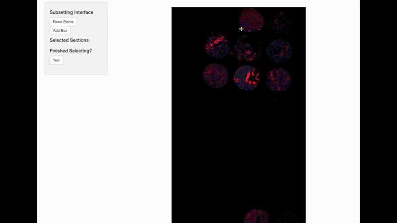

<style>
body {
  text-align: justify
}
.center {
  display: block;
  margin-left: auto;
  margin-right: auto;
}
</style>

```{css, echo=FALSE}
.watch-out {
  color: black;
}
```

```{r setup, include=FALSE}
# use rmarkdown::render_site(envir = knitr::knit_global())
knitr::opts_chunk$set(highlight = TRUE, echo = TRUE)
```

<br>

## ROI Analysis

VoltRon is capable of analyzing readouts from distinct spatial technologies including segmentation based transciptomics assays that capture a large polygonic regions within a tissue section. VoltRon's interface is capable of recognizing these datasets from these distinct technologies and allows users to use similar functions to analyze these datasets. 

We now import the GeoMx data, and start analyzing 87 user selected segments to check spatial localization of signals. 

```{r eval = FALSE, class.source="watch-out"}
# get data
GeoMxR1 <- importGeoMx("out/",
                       pkc_file = "out/Hs_R_NGS_WTA_v1.0.pkc",
                       summarySegment = "out/segmentSummary.xlsx",
                       summarySegmentSheetName = "Segment summary",
                       image = "out/morphology.tiff",
                       ome.tiff = "out/Lu 1A 1B 5 um, true exp.ome.tiff",
                       sample_name = "GeoMxR1")
```

<br>

### Processing

We first filter low count genes by extracting the count matrix and remove all genes whose maximum count across all 87 ROIs less than 10.

```{r eval = FALSE, class.source="watch-out"}
GeoMxR1_data <- vrData(GeoMxR1, norm = FALSE)
feature_ind <- apply(GeoMxR1_data, 1, function(x) max(x) > 10)
selected_features <- vrFeatures(GeoMxR1)[feature_ind]
GeoMxR1_lessfeatures <- subset(GeoMxR1, features = selected_features)
```

GeoMx platform provides both nuclei count per ROI as well as the transcipt count which we can measure the depth of each ROI. To measure the quality of each individual ROI, we add a new metadata column which indicates the transcript counts per nuclei. 

```{r eval = FALSE, class.source="watch-out"}
Metadata(GeoMxR1)$CountPerNuclei <- Metadata(GeoMxR1)$Count/Metadata(GeoMxR1)$Nuclei.count
GeoMxR1 <- subset(GeoMxR1, subset = CountPerNuclei > 500)
```

VoltRon is capable of normalizing data provided by a diverse set of spatial technologies, including the quantile normalization method suggested by the [GeoMx DSP Data Analysis User Manual](https://nanostring.com/support-documents/geomx-dsp-data-analysis-user-manual/) which scales the ROI profiles to the third quartile followed by the geometric mean of all third quartiles multipled to the scaled profile. 

```{r eval = FALSE, class.source="watch-out"}
GeoMxR1 <- normalizeData(GeoMxR1, method = "Q3Norm")
```

<br>

### Interactive subsetting

Spatially informed genomic technologies heavily depend on image manipulation and computer vision. Hence, VoltRon allows additional built-in operations to manipulate spatial images including operations that provide subsetting assays using the reference image. 

We first resize the morphology image relative to the width for reducing the size. 

```{r eval = FALSE, class.source="watch-out"}
# resizing the image
GeoMxR1 <- resizeImage(GeoMxR1, size = 4000)
```

VoltRon provides mini shiny apps to subsetting spatial points of a VoltRon object by using the image as a reference. Users may fit multiple tissue or organoid sections to a GeoMx scan area, hence we may use the shiny app to demultiplex/separate a single GeoMx experiment into multiple samples. 

```{r eval = FALSE, class.source="watch-out"}
GeoMxR1_subset <- subset(GeoMxR1, interactive = TRUE)
GeoMxR1_subset_list <- GeoMxR1_subset$subsets
GeoMxR1 <- merge(GeoMxR1_subset_list[[1]], GeoMxR1_subset_list[-1])
```



<br>

Users may also save the selected image subsets and reproduce the interactive subsetting operation for later use. 

```{r eval = FALSE, class.source="watch-out"}
subset_info_list <- GeoMxR1_subset$subset_info_list
GeoMxR1_subset_list <- list()
for(i in 1:length(subset_info_list[[1]])){
  sample_names <- paste0("Sample", 1:length(subset_info_list[[1]]))
  temp <- subset(GeoMxR1_less, image = subset_info_list[[1]][i])
  temp$Sample <- sample_names[i]
  GeoMxR1_subset_list[[i]]  <- temp
}
GeoMxR1 <- merge(GeoMxR1_subset_list[[1]], GeoMxR1_subset_list[-1])
```

<br>

### Visualization

We will now select sections of interests from the VoltRon object, and visualize features may anything with bla bla bla.

```{r eval = FALSE, class.source="watch-out"}
GeoMxR1_subset <- subset(GeoMxR1, sample = c("Sample1","Sample2"))
vrSpatialFeaturePlot(GeoMxR1_subset, features = c("CXCL11", "COL1A1"), group.by = "ROIlabel", label = TRUE, pt.size = 8, keep.scale = "all")
```
