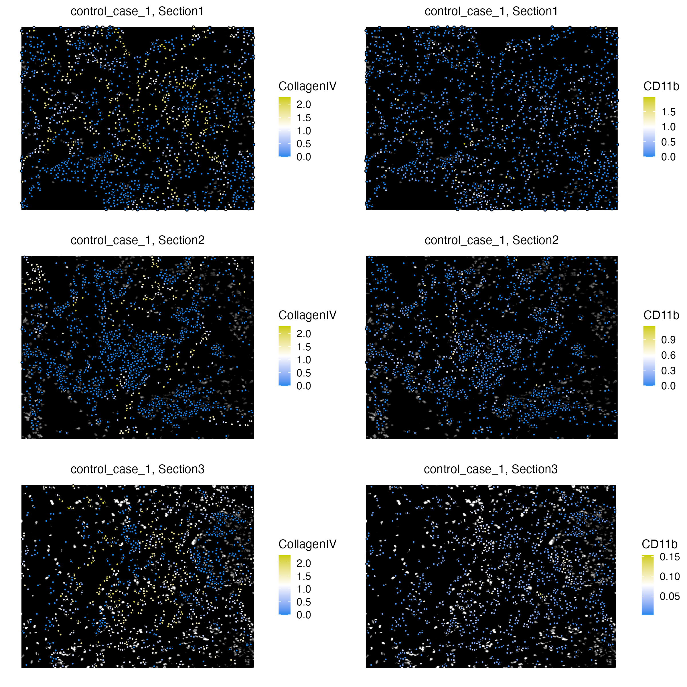
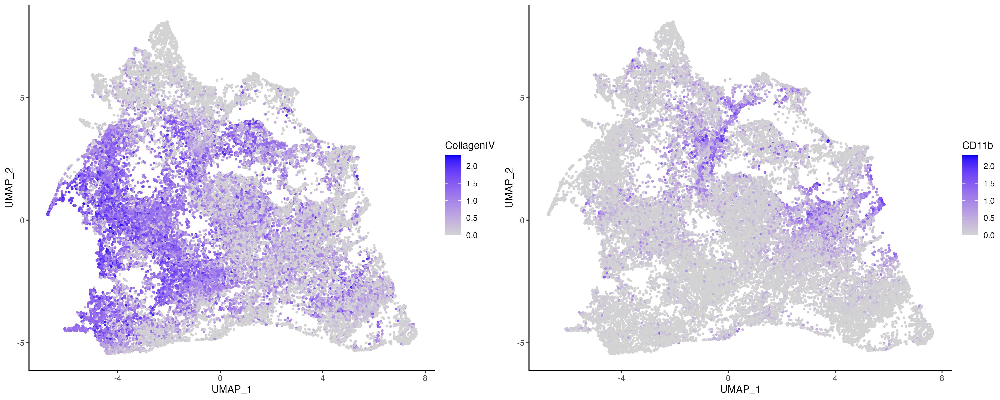
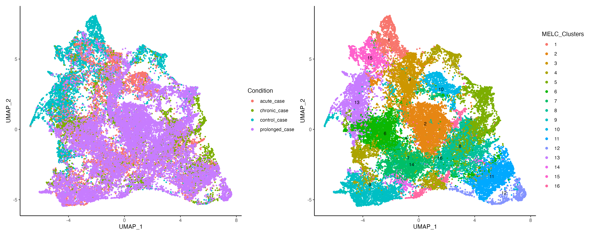
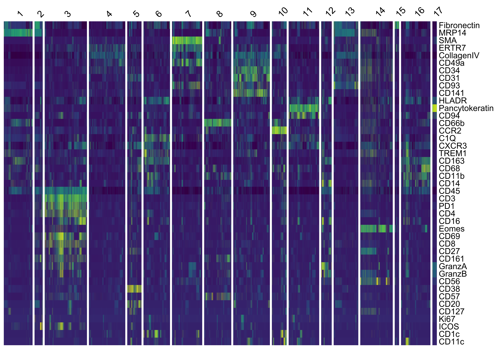
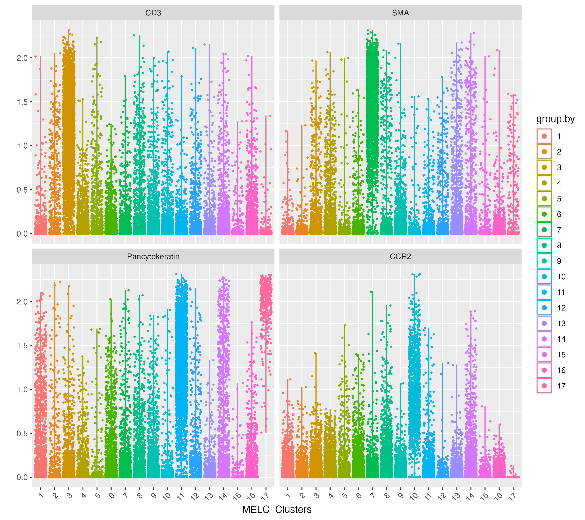

<style>
.title{
  display: none;
}
body {
  text-align: justify
}
.center {
  display: block;
  margin-left: auto;
  margin-right: auto;
}
</style>

```{css, echo=FALSE}
.watch-out {
  color: black;
}
```

```{r setup, include=FALSE}
# use rmarkdown::render_site(envir = knitr::knit_global())
knitr::opts_chunk$set(highlight = TRUE, echo = TRUE)
```

<br>

# Downstream analysis on Cells

VoltRon is also an end-to-end spatial data analysis package which supports investigating spatial points in any level of resoluion including single cell. VoltRon includes some essential built-in functions capable to filtering, processing and clustering as well as visualizing datasets on cells with a goal of cell type discovery and annotation. 

In this use case, we analyzed cells segmented from microscopy images of **control and COVID-19 lung tissues** of donors categorized based on disease durations (control, acute and prolonged). Each image is associated with one of few field of views (FOVs) of a single tissue section of a donor. See [GSE190732](https://www.ncbi.nlm.nih.gov/geo/query/acc.cgi?acc=GSE190732) for more information.  

We analyze cells characterized by multi-epitope ligand cartography (MELC) with a panel of 44 parameters. We use the already segmented cells which expression of 43 protein features mapped on these cells. 

We first import the protein intensities, metadata and coordinates associated with segmented cells across FOVs of samples.

```{r eval = FALSE, class.source="watch-out"}
# csv file
IFdata <- read.csv("data/IFdata.csv")
data <- IFdata[,c(2:43)]
metadata <- IFdata[,c("disease_state", "object_id", "cluster", "Clusters", 
                      "SourceID", "BioSample", "FOV", "Sample")]
coords <- as.matrix(IFdata[,c("posX","posY")], rownames.force = TRUE)
```

<br>

## Building the VoltRon object

First, we normalize the data using the hyperbolic arcsine function with a scale argument of 0.2.

```{r eval = FALSE, class.source="watch-out", fig.align='center'}
data <- asinh(data/0.2)
```

Before analyzing MELC assays of cells across FOVs, we should define a VoltRon object for each individual FOV/Section by using the **formVoltron** function where each object has only one section. We then merge these sections to respective tissue blocks using the sample of origins. We can also define assay names, types and sample (i.e. block) names of these objects using **formVoltron**.  

```{r eval = FALSE, class.source="watch-out", fig.align='center'}
vr_list <- list()
sample_metadata <- metadata %>% select(Sample, FOV, Section) %>% distinct()
for(i in 1:nrow(sample_metadata)){
  vrassay <- sample_metadata[i,]
  cells <- rownames(metadata)[metadata$Section == vrassay$Section]
  image <- image_read(paste0("../data/AnjaLung2023/DAPI/", vrassay$Sample, "/DAPI_", vrassay$FOV, ".tif"))
  vr_list[[vrassay$Section]] <- formVoltRon(data = t(data[cells,]), metadata = metadata[cells,],
                                           image = image, coords = coords[cells,],
                                           main.assay = "MELC", assay.type = "cell",
                                           sample_name = vrassay$Section)
}
```

In addition, we can flip the coordinates of the images and and then resize these images. The main reason for this coordinate flipping is that the y-axis of most digital images are of the opposite direction to the y-axis of euclidean space. Hence, VoltRon offers the option to flip images using **flipCoords** function. 

```{r eval = FALSE, class.source="watch-out", fig.align='center'}
for(i in 1:nrow(sample_metadata)){
  vrassay <- sample_metadata[i,]
  vr_list[[vrassay$Sample]] <- flipCoords(vr_list[[vrassay$Sample]])
  vr_list[[vrassay$Sample]] <- resizeImage(vr_list[[vrassay$Sample]], size = 600)
}
```

Finally, we merge these assays into one VoltRon object. The **samples** arguement in the merge function determines which assays are layers of a single tissue sample/block.

```{r eval = FALSE, class.source="watch-out", fig.align='center'}
vr_merged <- merge(vr_list[[1]], vr_list[-1], samples = sample_metadata$Sample)
vr_merged 
```

```
VoltRon Object 
control_case_3: 
  Layers: Section1 Section2 
control_case_2: 
  Layers: Section1 Section2 
control_case_1: 
  Layers: Section1 Section2 Section3 
acute_case_3: 
  Layers: Section1 Section2 
acute_case_1: 
  Layers: Section1 Section2 
... 
There are 13 samples in total 
Assays: MELC(Main) 
```

## Dimensionality Reduction

Lets visualize some protein features on tissue sections. We can either use the DAPI images as a background (e.g. **background = image**), or select either "black" or "white" backgrounds (e.g. **background = "white"**).

```{r eval = FALSE, class.source="watch-out", fig.align='center'}
vr_subset <- subset(vr_merged, samples = "control_case_1")
g1 <- vrSpatialFeaturePlot(vr_subset, features = c("CollagenIV", "CD11b"), alpha = 1, pt.size = 0.7)
```



<br>

VoltRon is capable of reducing dimensionality of assay datasets using both PCA and UMAP which we gonna use to build neighborhood graphs and partition the data in cell types.  

```{r eval = FALSE, class.source="watch-out", fig.align='center'}
vr_merged <- getPCA(vr_merged, dims = 10)
vr_merged <- getUMAP(vr_merged, dims = 1:10)
```

We can also visualize the expression and measure of these features on embedding spaces. 

```{r eval = FALSE, class.source="watch-out", fig.align='center'}
vrEmbeddingFeaturePlot(vr_merged, features = c("CollagenIV", "CD11b"), embedding = "umap")
```



<br>

## Clustering

Next, we build neighborhood graphs using the k-nearest neighbor graphs of cells using dimensionally reduced gene expression profiles. We can conduct a clustering of cells using leiden's method. 

```{r eval = FALSE, class.source="watch-out", fig.align='center'}
vr_merged <- getNeighbors(vr_merged, dims = 1:10, k = 10, method = "kNN")
vr_merged <- getClusters(vr_merged, resolution = 0.8, label = "MELC_Clusters")
```

Now we can visualize these clusters and perhaps check for possibly existing inter-condition variances that may reside across within the data. 

```{r eval = FALSE, class.source="watch-out", fig.align='center'}
Metadata(vr_merged)$Condition <- gsub("_[0-9]$", "", Metadata(vr_merged)$Sample)
g1 <- vrEmbeddingPlot(vr_merged, group.by = c("Condition"), embedding = "umap")
g2 <- vrEmbeddingPlot(vr_merged, group.by = c("MELC_Clusters"), embedding = "umap", label = TRUE)
g1 | g2
```



<br>

## Visualization

VoltRon provides both violin plots (vrViolinPlot) and heatmaps (vrHeatmapPlot) to further investigate the enrichment of markers across newly clustered dataset. 

```{r eval = FALSE, class.source="watch-out", fig.align='center'}
vrHeatmapPlot(vr_merged, features = vrFeatures(vr_merged), 
              group.by = "MELC_Clusters", show_row_names = TRUE)
```



<br>

```{r eval = FALSE, class.source="watch-out", fig.align='center'}
vrViolinPlot(vr_merged, features = c("CD3", "SMA", "Pancytokeratin", "CCR2"), 
             group.by = "MELC_Clusters", ncol = 2)
```



<br>
