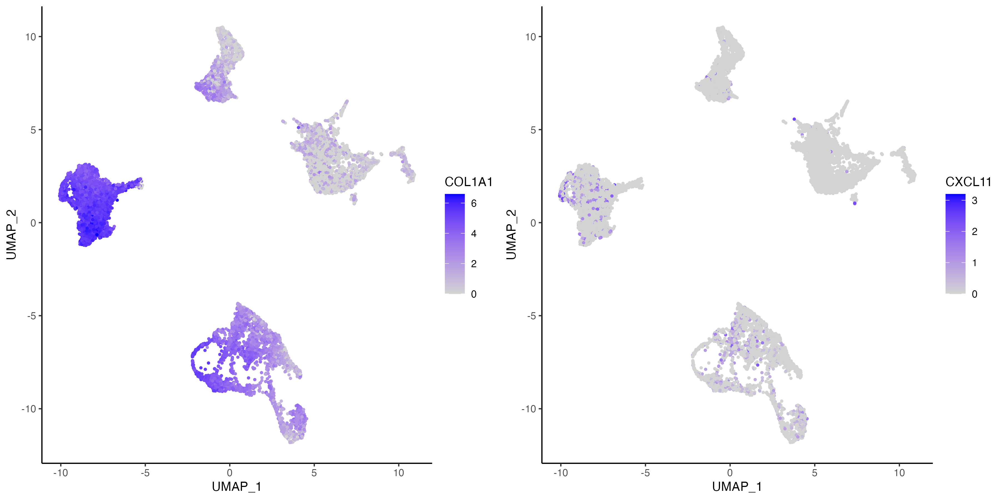
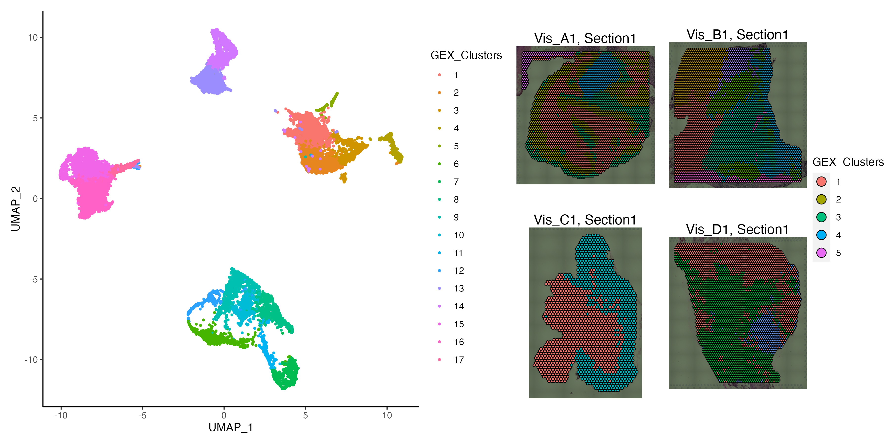

<style>
body {
  text-align: justify
}
.center {
  display: block;
  margin-left: auto;
  margin-right: auto;
}
</style>

```{css, echo=FALSE}
.watch-out {
  color: black;
}
```

```{r setup, include=FALSE}
# use rmarkdown::render_site(envir = knitr::knit_global())
knitr::opts_chunk$set(highlight = TRUE, echo = TRUE)
```

<br>

# Downstream analysis on Cells and Spots

VoltRon is also an end-to-end spatial data analysis package. VoltRon includes some essential built-in functions capable to filtering, processing and clustering as well as visualizing datasets on both spatial and embeddings domains. 

```{r eval = FALSE, class.source="watch-out"}
library(VoltRon)

# Load Visium Data
Vis_A1 <- importVisium("hColon_N_A1/", sample_name = "Vis_A1")
Vis_B1 <- importVisium("hColon_T_B1/", sample_name = "Vis_B1")
Vis_C1 <- importVisium("hColon_N_C1/", sample_name = "Vis_C1")
Vis_D1 <- importVisium("hColon_T_D1/", sample_name = "Vis_D1")

# merge datasets
Vis_CRC <- list(Vis_A1, Vis_B1, Vis_C1, Vis_D1)
Vis_CRC <- merge(Vis_CRC[[1]], Vis_CRC[-1])
```

<br>

## Processing

In order to dimensionally reduce and cluster spots, we first need to normalize the count table. VoltRon is capable to normalizing data of any type of spatial points (ROIs, spots, cells and molecules). For spots and cells, standard choice of normalization method is the size factor scaling followed by log transformation. 

```{r eval = FALSE, class.source="watch-out", fig.align='center'}
# assay
vrMainAssay(Vis_CRC) <- "Visium"

# normalize
Vis_CRC <- normalizeData(Vis_CRC, method = "LogNorm")
```

<br>

## Feature Selection and Reduction

Later, we detect features of each assay associated with the main assay and update the feature data.

```{r eval = FALSE, class.source="watch-out", fig.align='center'}

# get variable features
Vis_CRC <- getFeatures(Vis_CRC)
```

VoltRon is capable of computing both PCA and UMAP level embeddings of the normalized data with or without a selected number of variable features. VoltRon also allows users to compute UMAPs from any type of data in which cases PCA reduction is redundant due to small number of features in the original dataset. 

```{r eval = FALSE, class.source="watch-out", fig.align='center'}
# get embedding
Vis_CRC <- getPCA(Vis_CRC)
Vis_CRC <- getUMAP(Vis_CRC)

# visualize markers
vrEmbeddingFeaturePlot(Vis_CRC, features = c("COL1A1", "CXCL11"), embedding = "umap")
```



<br>

## NN-nased Clustering

We search for k-nearest neighbors of each spot using either a PCA embedding, normalized data or any data available to the VoltRon object. The graph built by the **getNeighbors** function is then incorporated to cluster the spots using leiden clustering with a given resolution parameter. 

```{r eval = FALSE, class.source="watch-out", fig.align='center'}
# get neighbors
Vis_CRC <- getNeighbors(Vis_CRC)

# get clustering
Vis_CRC <- getClusters(Vis_CRC, resolution = 1, label = "GEX_Clusters")
```

<br>

## Visualization

VoltRon allows visualizing the clusters of spots on both the spatial and the embedding domains

```{r eval = FALSE, class.source="watch-out", fig.align='center'}
# visualize embedding and spatial data
g_embed <- vrEmbeddingPlot(Vis_CRC, group.by = "GEX_Clusters", embedding = "umap")
g_spatial <- vrSpatialPlot(Vis_CRC, group.by = "GEX_Clusters", crop = TRUE, alpha = 1)
g_embed | g_spatial
```


