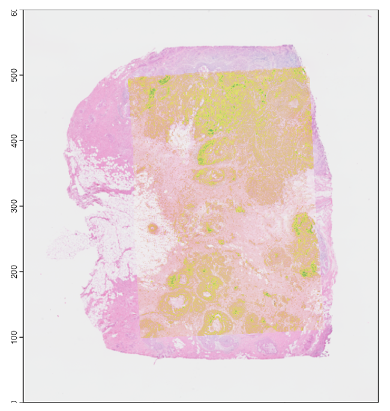
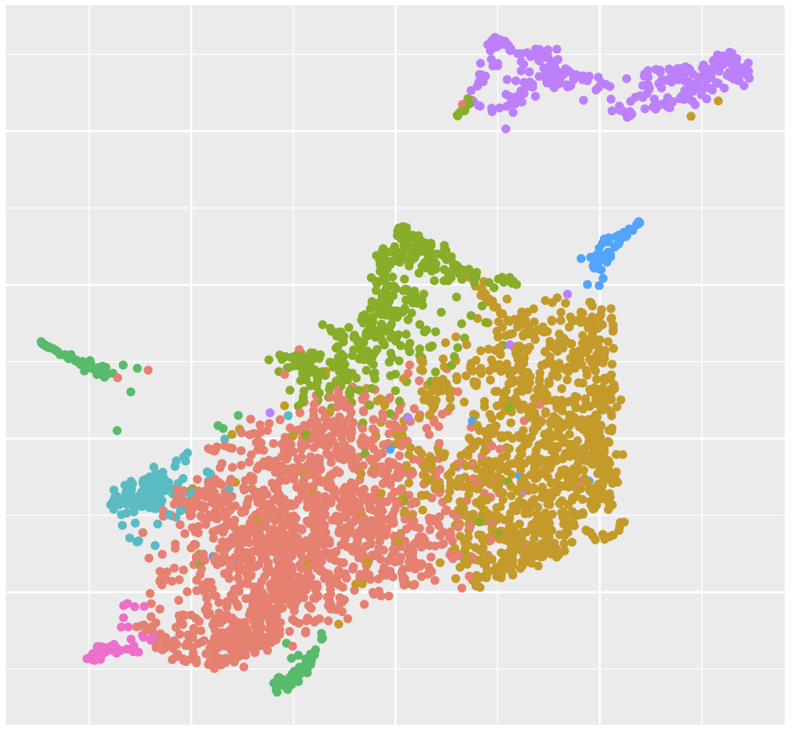
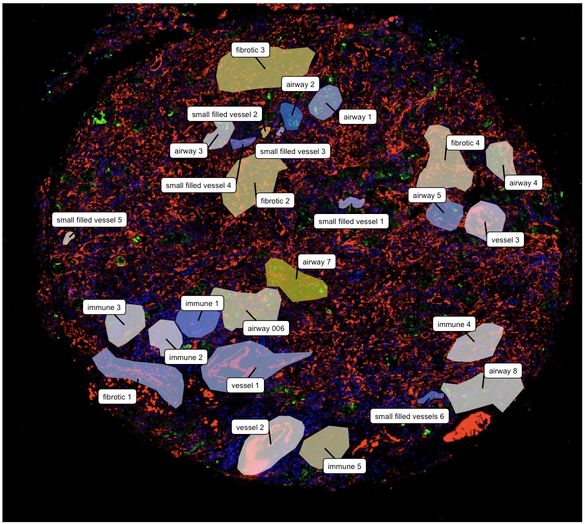
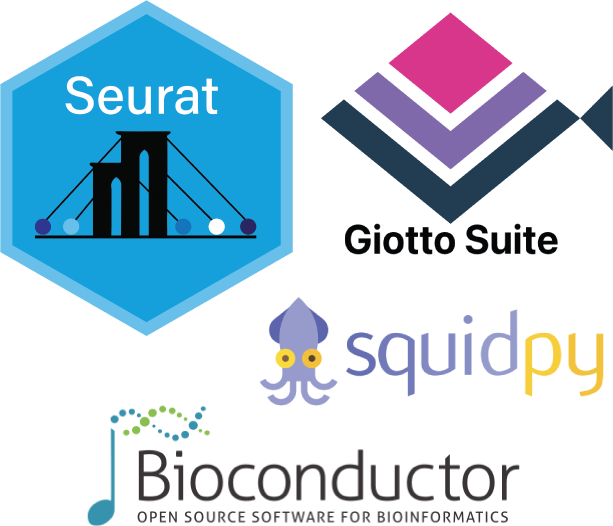

<style>
body {
  text-align: justify
}
table, th, td, tr{
  empty-cells:hide;
  border-spacing: 25px;
  border-collapse: separate;
}
td{
  filter:drop-shadow(0 0 10px rgba(0,0,0,0.3));
  padding: 10px;
  background:white;
  text-align:center;
  width:33%;
  vertical-align: text-top;
}
td:hover, td:active{
  filter:drop-shadow(0 0 10px rgba(0,0,0,0.3));
  transform: scale(1.02);
  cursor: pointer;
}
.main-container {
  max-width: 1200px;
  margin-left: auto;
  margin-right: auto;
}
p.tutorial {
  text-decoration: none!important;
  font-size: 1.5em;
  color: #23803A;
  margin: 3%
}
</style>

```{r setup, include=FALSE}
# use rmarkdown::render_site(envir = knitr::knit_global())
knitr::opts_chunk$set(echo = TRUE)
```

<br>
<br>

## Spatial Data Analysis with VoltRon

<br>

### Spatial Data Integration

**VoltRon** incorporates multiple data integration modules to achieve data transfer across a diverse set of transcriptomics modalities. We incorporate the OpenCV, fully embedded into VoltRon using Rcpp, to incorporate alignment across spatial datasets using computer vision and image registration. Users can automaticaly or manually align a list of images (H&E, microscopy or DAPI images) using a small shiny images.

In addition, VoltRon integrates with ST spot deconvolution methods such as RCTD and SpotLIGHT to infer estimates cell type abundances of a reference single cell data (Seurat, SingleCellExperiment etc.) to generate additional assays associated with layers of the VoltRon object, and implements clustering on cell type abundance data to discover niches in the dataset. 

<table>
<tbody>
  <tr>
   <td onclick="location.href='registration.html';"> 
      <p class ="tutorial"> Spatial Data Alignment </p>
      
      <p style = "margin: 3%"> Manual and automated alignment of spatial data assays</p>
   </td>
   <td onclick="location.href='deconvolution.html';"> 
      <p class ="tutorial"> Niche Clustering </p>
      
      <p style = "margin: 3%"> Clustering with ROI/spot deconvolution</p>
   </td>
   <td> 
   </td>
  </tr>
</tbody>
</table>

<br>
<br>

### Downstream Analysis and Utilities

**VoltRon** is also capable of end-to-end analysis of diverse set of spatial data types such as ROI (region of interest) based, spot-based, cell-based and molecule-based assays. VoltRon objects can be converted to a diverse set of objects/datatypes commonly incorporated spatial data analysis (Seurat, SpatialExperiment, Squidpy, SpatialData etc.) 

<table>
<tbody>
  <tr>
   <td onclick="location.href='spotanalysis.html';"> 
      <p class ="tutorial"> Cells/Spots </p>
      
      <p style = "margin: 3%"> Quality control, analysis and visualization of Cell/Spot datasets </p>
   </td>
   <td onclick="location.href='roianalysis.html';"> 
      <p class ="tutorial"> Region of Interests (ROIs) </p>
      
      <p style = "margin: 3%"> Quality control, analysis and visualization of ROI segments </p>
   </td>
   <td> 
      <p class ="tutorial"> Converting VoltRon Objects </p>
      
      <p style = "margin: 3%"> Converting VoltRon objects into Seurat, Giotto, squidpy (anndaata) etc. </p>
   </td>
  </tr>
</tbody>
</table>

<br>
